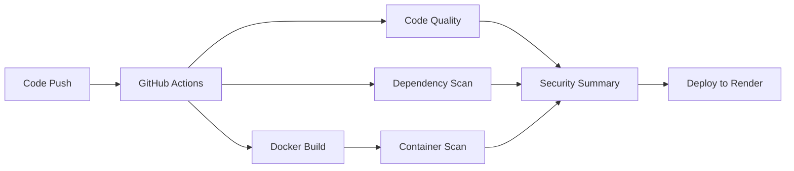

# ⚽ Football Information System - DevSecOps Implementation

Hệ thống thông tin bóng đá toàn diện với chức năng đăng nhập phân quyền, quản lý dữ liệu từ các giải đấu hàng đầu thế giới, được triển khai với mô hình DevSecOps hoàn chỉnh.

## 🔒 DevSecOps Implementation

**Branch:** `cicd-pipeline`  
**Status:** ✅ Production Ready  
**Live Demo:** https://fb-news-rlrs.onrender.com/

### **Security Features:**
- ✅ **SAST** - Bandit code scanning
- ✅ **Dependency Scan** - Safety vulnerability check  
- ✅ **Container Scan** - Trivy image scanning
- ✅ **CI/CD Pipeline** - Automated security gates
- ✅ **Docker** - Production-ready with security hardening
- ✅ **Auto-Deploy** - Render.com integration

## 🚀 Quick Start

### **Local Development:**
```bash
# 1. Clone repository
git clone https://github.com/thangnt04-scr/FB-News.git
cd FB-News

# 2. Setup environment
python -m venv venv
venv\Scripts\activate  # Windows
# source venv/bin/activate  # Linux/Mac

# 3. Install dependencies
pip install -r requirements.txt

# 4. Create admin user
python create_admin.py

# 5. Run application
python app.py
```

### **Docker Deployment:**
```bash
# Build and run with Docker
docker-compose up -d

# View at http://localhost:5000
```

### **DevSecOps Demo:**
```bash
# Run complete DevSecOps workflow
.\demo-all.ps1

# Or run security scans only
.\run-devsecops-scans.ps1
```

## 🎯 Tính năng chính

### 👥 Cho tất cả người dùng:
- 🌍 Xem thông tin giải đấu, đội bóng, cầu thủ từ các giải hàng đầu
- 📊 Thống kê và dữ liệu chi tiết
- 🔍 Tìm kiếm nhanh
- 📱 Giao diện responsive, thân thiện

### 👑 Cho Admin:
- 🎛️ Dashboard quản lý toàn diện
- 👥 Quản lý người dùng (xem, sửa role, xóa)
- ➕ Thêm/sửa/xóa dữ liệu bóng đá
- 📈 Thống kê hệ thống
- 🔧 Cấu hình và bảo trì

### 👤 Cho User thường:
- 👀 Chỉ xem thông tin (read-only)
- 📋 Profile cá nhân
- 🚫 Không thể truy cập Dashboard
- 🚫 Không thể chỉnh sửa dữ liệu

## 🔐 Tài khoản mặc định

| Role | Username | Password | Quyền hạn |
|------|----------|----------|-----------|
| 👑 **Admin** | `admin` | `admin123` | Toàn quyền |
| 👤 **User** | `user` | `user123` | Chỉ xem |

## 📁 Cấu trúc dự án

```
Football/
├── 📄 app.py                 # Ứng dụng Flask chính
├── 🗄️ db.py                  # Database và functions
├── 🔐 auth.py                # Authentication module
├── 🛡️ decorators.py          # Custom decorators
├── 👤 create_admin.py        # Script tạo admin
├── 📊 populate_db.py         # Populate database data
├── 🔍 verify_data.py         # Database verification
├── 📋 requirements.txt       # Dependencies
├── 🐳 Dockerfile             # Production Docker image
├── 🐳 docker-compose.yml     # Docker Compose config
├── ☁️  render.yaml           # Render configuration
├── 🔧 build.sh               # Render build script
├── 🔒 run-devsecops-scans.ps1 # Security scan script
├── 🎬 demo-all.ps1           # Complete demo script
├── 📁 .github/workflows/
│   └── devsecops.yml         # CI/CD pipeline
├── 📁 reports/               # Security scan reports
├── 📁 templates/             # HTML templates
└── 📁 static/                # CSS/JS assets
```

## 🛡️ DevSecOps Implementation

### **I. Chuẩn bị môi trường**
- ✅ Python 3.11+ với virtual environment
- ✅ Docker & Docker Compose
- ✅ Security tools: Bandit, Safety, Trivy
- ✅ Git & GitHub Actions

### **II. Docker hóa ứng dụng**
- ✅ Multi-stage Dockerfile với security hardening
- ✅ Non-root user (appuser:1000)
- ✅ Resource limits và capability dropping
- ✅ Health checks và monitoring

### **III. Quét bảo mật thủ công**
- ✅ **Bandit (SAST):** Static code analysis
- ✅ **Safety:** Dependency vulnerability scan
- ✅ **Trivy:** Container security scan
- ✅ Automated reporting và artifact storage

### **IV. Tích hợp tự động (CI/CD)**
- ✅ GitHub Actions workflow
- ✅ Automated security gates
- ✅ Multi-job pipeline với parallel execution
- ✅ Artifact management và reporting

### **V. Triển khai lên Cloud**
- ✅ Render.com configuration
- ✅ Auto-deployment từ GitHub
- ✅ Environment variables management
- ✅ Health monitoring và logging

### **VI. Báo cáo và minh chứng**
- ✅ Comprehensive security reports
- ✅ CI/CD pipeline documentation
- ✅ Deployment verification
- ✅ Performance monitoring

## 🔧 API Endpoints

### 🌐 Public Endpoints
```
GET  /                    # Trang chủ
GET  /login              # Form đăng nhập
POST /login              # Xử lý đăng nhập
GET  /register           # Form đăng ký
POST /register           # Xử lý đăng ký
GET  /api/leagues        # Danh sách giải đấu
GET  /api/leagues/{id}/teams  # Đội bóng trong giải
GET  /api/teams/{id}     # Chi tiết đội bóng
GET  /api/teams/{id}/players  # Cầu thủ của đội
GET  /api/players/{id}   # Chi tiết cầu thủ
GET  /health             # Health check
```

### 🔐 Protected Endpoints
```
GET  /profile            # Profile cá nhân
GET  /logout             # Đăng xuất
```

### 👑 Admin Only Endpoints
```
GET  /dashboard          # Dashboard admin
GET  /api/admin/users    # Danh sách users
PUT  /api/admin/users/{id}/role  # Cập nhật role
DELETE /api/admin/users/{id}     # Xóa user
```

## 🛡️ Security Features

- ✅ **Password Hashing:** Werkzeug secure hashing
- ✅ **Session Management:** Flask-Login với secure sessions
- ✅ **Role-based Access:** Phân quyền Admin/User rõ ràng
- ✅ **CSRF Protection:** Flask tự động bảo vệ
- ✅ **Input Validation:** Kiểm tra dữ liệu đầu vào
- ✅ **Container Security:** Non-root user, capability dropping
- ✅ **Dependency Security:** Regular vulnerability scanning
- ✅ **Code Security:** SAST scanning với Bandit

## 🎨 Technology Stack

- **Backend:** Python 3.11, Flask 3.0, SQLite
- **Frontend:** Bootstrap 5, Font Awesome, JavaScript
- **Security:** Bandit, Safety, Trivy, Werkzeug
- **Containerization:** Docker, Docker Compose
- **CI/CD:** GitHub Actions
- **Cloud:** Render.com
- **API:** football-data.org

## 📊 Database Schema

```sql
-- Bảng người dùng
users (id, username, email, password_hash, role, created_at)

-- Bảng giải đấu
leagues (id, name, country_code, external_id)

-- Bảng đội bóng
teams (id, league_id, name, short_name, founded_year, stadium, external_id)

-- Bảng cầu thủ
players (id, team_id, name, nationality, position, shirt_number, birthdate, height_cm, weight_kg, external_id)

-- Bảng trận đấu
matches (id, league_id, season, match_date, home_team_id, away_team_id, home_score, away_score, external_id)
```

## 🔄 CI/CD Pipeline



## 📈 Monitoring & Health Checks

- **Application Health:** `/health` endpoint
- **Container Health:** Docker health checks
- **Security Monitoring:** Automated scans
- **Performance:** Resource monitoring
- **Logs:** Centralized logging

## 🐛 Troubleshooting

### Common Issues:

1. **"Module not found"**
   ```bash
   pip install -r requirements.txt
   ```

2. **"Database locked"**
   - Restart application
   - Check for running processes

3. **"Port 5000 already in use"**
   ```bash
   # Change port in app.py
   app.run(debug=True, port=5001)
   ```

4. **Docker build fails**
   ```bash
   docker system prune -a
   docker-compose build --no-cache
   ```

5. **Security scan errors**
   ```bash
   # Check tool installation
   bandit --version
   safety --version
   trivy --version
   ```

## 📚 Documentation

- 📖 [Complete DevSecOps Report](DEVSECOPS-COMPLETE-REPORT.md)
- 📖 [Project Description](PROJECT-DESCRIPTION.md)
- 📖 [Demo Report Guide](DEMO-REPORT-GUIDE.md)
- 📖 [Output Evidence](OUTPUT-EVIDENCE.md)

## 🔗 Links

- 🔗 [GitHub Repository](https://github.com/thangnt04-scr/FB-News)
- 🔗 [GitHub Actions](https://github.com/thangnt04-scr/FB-News/actions)
- 🔗 [Live Demo](https://fb-news-rlrs.onrender.com/)
- 🔗 [Security Reports](reports/)

## 🤝 Contributing

1. Fork repository
2. Create feature branch
3. Commit changes
4. Push to branch
5. Create Pull Request
